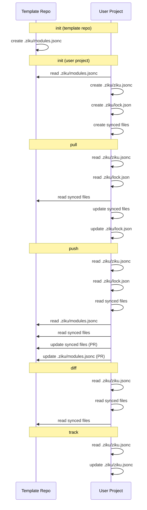

# File Lifecycle

> このドキュメントは `npm run docs` で自動生成されます。直接編集しないでください。

ziku が管理するファイルと、各コマンドでの振る舞いを整理したドキュメント。

<!-- LIFECYCLE:START -->

## ファイル一覧

| ファイル              | 存在する場所               | 役割                                                                                                                                                             |
| --------------------- | -------------------------- | ---------------------------------------------------------------------------------------------------------------------------------------------------------------- |
| `.ziku/modules.jsonc` | テンプレートリポジトリのみ | 同期対象の glob パターンを定義する「メニュー表」。init 時にユーザーが選ぶモジュール一覧の元データ。push 時にローカル追加パターンが書き戻される                   |
| `.ziku/ziku.jsonc`    | ユーザーのプロジェクトのみ | 同期設定。テンプレートの source（owner/repo）と、選択済みの include/exclude パターンを保持。track コマンドで追加可能                                             |
| `.ziku/lock.json`     | ユーザーのプロジェクトのみ | 同期状態。前回同期時のコミット SHA（baseRef）、ファイルごとの SHA-256 ハッシュ（baseHashes）、未解決マージ情報（pendingMerge）を保持。pull/push の差分検出に使用 |

## ライフサイクル図

## コマンドごとのファイル操作

### `init (template repo)`

テンプレートリポジトリの初期化

| 操作 | ファイル              | 場所     | 詳細                                         |
| ---- | --------------------- | -------- | -------------------------------------------- |
| 作成 | `.ziku/modules.jsonc` | template | デフォルトパターンで生成（既存ならスキップ） |

### `init (user project)`

ユーザープロジェクトの初期化

| 操作     | ファイル              | 場所     | 詳細                                               |
| -------- | --------------------- | -------- | -------------------------------------------------- |
| 読み取り | `.ziku/modules.jsonc` | template | モジュール選択 UI に使用                           |
| 作成     | `.ziku/ziku.jsonc`    | local    | 選択パターンをフラット化して保存                   |
| 作成     | `.ziku/lock.json`     | local    | ベースコミット SHA + ハッシュを記録                |
| 作成     | synced files          | local    | テンプレートからパターンに一致するファイルをコピー |

### `pull`

テンプレートの最新更新をローカルに反映

| 操作     | ファイル           | 場所     | 詳細                                   |
| -------- | ------------------ | -------- | -------------------------------------- |
| 読み取り | `.ziku/ziku.jsonc` | local    | source と patterns を取得              |
| 読み取り | `.ziku/lock.json`  | local    | 前回の baseHashes, baseRef を取得      |
| 読み取り | synced files       | template | テンプレートをダウンロードして差分比較 |
| 更新     | synced files       | local    | 自動更新・新規追加・3-way マージ・削除 |
| 更新     | `.ziku/lock.json`  | local    | 新しい baseHashes, baseRef で上書き    |

### `push`

ローカルの変更をテンプレートリポジトリに PR として送信

| 操作     | ファイル              | 場所     | 詳細                                                 |
| -------- | --------------------- | -------- | ---------------------------------------------------- |
| 読み取り | `.ziku/ziku.jsonc`    | local    | source と patterns を取得                            |
| 読み取り | `.ziku/lock.json`     | local    | baseRef, baseHashes を取得                           |
| 読み取り | synced files          | local    | ローカルの変更を検出                                 |
| 読み取り | `.ziku/modules.jsonc` | template | テンプレートのパターンと比較し、ローカル追加分を検出 |
| 読み取り | synced files          | template | テンプレートをダウンロードして差分検出・3-way マージ |
| 更新     | synced files          | template | 変更ファイルを含む PR を作成                         |
| 更新     | `.ziku/modules.jsonc` | template | ローカルで追加されたパターンがあれば PR に含めて更新 |

### `diff`

ローカルとテンプレートの差分を表示

| 操作     | ファイル           | 場所     | 詳細                               |
| -------- | ------------------ | -------- | ---------------------------------- |
| 読み取り | `.ziku/ziku.jsonc` | local    | patterns を取得                    |
| 読み取り | synced files       | local    | ローカルファイルを読み取り         |
| 読み取り | synced files       | template | テンプレートをダウンロードして比較 |

### `track`

同期対象のパターンを追加

| 操作     | ファイル           | 場所  | 詳細                            |
| -------- | ------------------ | ----- | ------------------------------- |
| 読み取り | `.ziku/ziku.jsonc` | local | 現在の include パターンを取得   |
| 更新     | `.ziku/ziku.jsonc` | local | 新しいパターンを include に追加 |

## 補足

### modules.jsonc の役割

`.ziku/modules.jsonc` はテンプレートリポジトリにのみ存在する「メニュー表」。
同期対象のファイルパターンを、モジュール（名前・説明付きのグループ）として定義する。

**init 時**: ユーザーがどのモジュールを使うか選ぶ際の選択肢になる。選択結果はフラット化（モジュール構造を外して glob パターンだけにする）され、
ユーザーのプロジェクトには `.ziku/ziku.jsonc` として保存される。つまり `.ziku/modules.jsonc` 自体はユーザーのプロジェクトにはコピーされない。

**push 時**: ユーザーが `ziku track` で追加した新しいパターンがあれば、`.ziku/modules.jsonc` に書き戻される（PR 経由）。
これにより、他のプロジェクトが init する際にも新パターンが選択肢に含まれるようになる。

### ziku.jsonc と modules.jsonc は init 後に独立

init が完了すると、`.ziku/ziku.jsonc` のパターンはテンプレートの `.ziku/modules.jsonc` から独立して管理される。
ユーザーが `ziku track` で追加したパターンは `.ziku/ziku.jsonc` にのみ反映され、テンプレートのどのモジュールにも属さない（push するまで）。
逆に、テンプレート側で `.ziku/modules.jsonc` にモジュールを追加しても、既存ユーザーの `.ziku/ziku.jsonc` には自動反映されない。

<!-- LIFECYCLE:END -->
