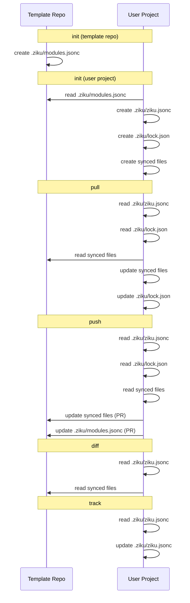

# File Lifecycle

> このドキュメントは `npm run docs` で自動生成されます。直接編集しないでください。

ziku が管理するファイルと、各コマンドでの振る舞いを整理したドキュメント。

<!-- LIFECYCLE:START -->

## ファイル一覧

| ファイル | 存在する場所 | 役割 |
|---|---|---|
| `.ziku/modules.jsonc` | テンプレートリポジトリのみ | モジュール定義（名前・説明・パターン）。init 時の選択 UI に使われる |
| `.ziku/ziku.jsonc` | ユーザーのプロジェクトのみ | 同期設定。テンプレートの source と、選択済みの include/exclude パターンを保持 |
| `.ziku/lock.json` | ユーザーのプロジェクトのみ | 同期状態。ベースコミット SHA、ファイルハッシュ、未解決マージ情報を保持 |

## ライフサイクル図

## コマンドごとのファイル操作

### `init (template repo)`

テンプレートリポジトリの初期化

| 操作 | ファイル | 場所 | 詳細 |
|---|---|---|---|
| 作成 | `.ziku/modules.jsonc` | template | デフォルトパターンで生成（既存ならスキップ） |

### `init (user project)`

ユーザープロジェクトの初期化

| 操作 | ファイル | 場所 | 詳細 |
|---|---|---|---|
| 読み取り | `.ziku/modules.jsonc` | template | モジュール選択 UI に使用 |
| 作成 | `.ziku/ziku.jsonc` | local | 選択パターンをフラット化して保存 |
| 作成 | `.ziku/lock.json` | local | ベースコミット SHA + ハッシュを記録 |
| 作成 | synced files | local | テンプレートからパターンに一致するファイルをコピー |

### `pull`

テンプレートの最新更新をローカルに反映

| 操作 | ファイル | 場所 | 詳細 |
|---|---|---|---|
| 読み取り | `.ziku/ziku.jsonc` | local | source と patterns を取得 |
| 読み取り | `.ziku/lock.json` | local | 前回の baseHashes, baseRef を取得 |
| 読み取り | synced files | template | テンプレートをダウンロードして差分比較 |
| 更新 | synced files | local | 自動更新・新規追加・3-way マージ・削除 |
| 更新 | `.ziku/lock.json` | local | 新しい baseHashes, baseRef で上書き |

### `push`

ローカルの変更をテンプレートリポジトリに PR として送信

| 操作 | ファイル | 場所 | 詳細 |
|---|---|---|---|
| 読み取り | `.ziku/ziku.jsonc` | local | source と patterns を取得 |
| 読み取り | `.ziku/lock.json` | local | baseRef, baseHashes を取得 |
| 読み取り | synced files | local | ローカルの変更を検出 |
| 更新 | synced files | template | 変更ファイルを含む PR を作成 |
| 更新 | `.ziku/modules.jsonc` | template | ローカルで追加されたパターンがあれば更新 |

### `diff`

ローカルとテンプレートの差分を表示

| 操作 | ファイル | 場所 | 詳細 |
|---|---|---|---|
| 読み取り | `.ziku/ziku.jsonc` | local | patterns を取得 |
| 読み取り | synced files | template | テンプレートをダウンロードして比較 |

### `track`

同期対象のパターンを追加

| 操作 | ファイル | 場所 | 詳細 |
|---|---|---|---|
| 読み取り | `.ziku/ziku.jsonc` | local | 現在の include パターンを取得 |
| 更新 | `.ziku/ziku.jsonc` | local | 新しいパターンを include に追加 |

## 補足

### modules.jsonc はユーザーのプロジェクトに存在しない

`ziku init` でユーザーのプロジェクトに作られるのは `.ziku/ziku.jsonc` と `.ziku/lock.json` だけ。
`.ziku/modules.jsonc` はテンプレートリポジトリ専用のファイルであり、init 時にモジュール選択 UI を表示するためだけに使われる。
選択結果はフラット化されて `.ziku/ziku.jsonc` の `include` に保存される。

### ziku.jsonc と modules.jsonc は独立

init 後、`.ziku/ziku.jsonc` のパターンはテンプレートの `.ziku/modules.jsonc` から独立している。
ユーザーが `ziku track` で追加したパターンは、テンプレートのどのモジュールにも属さない。
テンプレートが `.ziku/modules.jsonc` にモジュールを追加しても、既存ユーザーの `.ziku/ziku.jsonc` には自動反映されない。

<!-- LIFECYCLE:END -->
