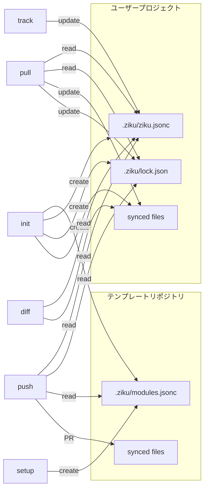

# File Lifecycle

> このドキュメントは `npm run docs` で自動生成されます。直接編集しないでください。

ziku が管理するファイルと、各コマンドでの振る舞いを整理したドキュメント。

<!-- LIFECYCLE:START -->

## コンポーネント関係図

## ファイルごとのライフサイクル

### `.ziku/modules.jsonc`

**場所:** テンプレートリポジトリ  
**役割:** モジュール定義（Claude Code ルール、MCP 設定などのグループ）

| フェーズ | 詳細                                                        |
| -------- | ----------------------------------------------------------- |
| 生成     | `ziku setup` でデフォルトモジュールを含む初期ファイルを作成 |
| 読み取り | `ziku init` でモジュール選択 UI のデータとして使用          |
| 読み取り | `ziku push` でテンプレートのパターンとローカルの差分を検出  |

### `.ziku/ziku.jsonc`

**場所:** ユーザープロジェクト  
**役割:** 同期設定（source + 選択済み include/exclude パターン）

| フェーズ | 詳細                                                        |
| -------- | ----------------------------------------------------------- |
| 生成     | `ziku init` でモジュール選択結果をフラット化して保存        |
| 読み取り | `pull` / `push` / `diff` でパターンとテンプレート情報を取得 |
| 更新     | `ziku track` で新しいパターンを追加                         |

### `.ziku/lock.json`

**場所:** ユーザープロジェクト  
**役割:** 同期状態（baseRef, baseHashes, pendingMerge）

| フェーズ | 詳細                                                      |
| -------- | --------------------------------------------------------- |
| 生成     | `ziku init` でテンプレートのコミット SHA とハッシュを記録 |
| 読み取り | `pull` / `push` で前回同期状態との差分検出に使用          |
| 更新     | `ziku pull` で最新のベースに更新                          |

### synced files

**場所:** 両方  
**役割:** パターンに一致する実際のファイル群（.claude/rules/\*.md など）

| フェーズ | 詳細                                                     |
| -------- | -------------------------------------------------------- |
| 生成     | `ziku init` でテンプレートからコピー                     |
| 更新     | `ziku pull` で 3-way マージにより同期                    |
| 更新     | `ziku push` でローカル変更を PR としてテンプレートに送信 |

## コマンドごとのファイル操作

### `setup`

テンプレートリポジトリの初期化

| 操作 | ファイル              | 場所     | 詳細                                           |
| ---- | --------------------- | -------- | ---------------------------------------------- |
| 作成 | `.ziku/modules.jsonc` | template | デフォルトモジュールで生成（既存ならスキップ） |

### `init (user project)`

ユーザープロジェクトの初期化

| 操作     | ファイル              | 場所     | 詳細                                               |
| -------- | --------------------- | -------- | -------------------------------------------------- |
| 読み取り | `.ziku/modules.jsonc` | template | モジュール選択 UI に使用                           |
| 作成     | `.ziku/ziku.jsonc`    | local    | 選択パターンをフラット化して保存                   |
| 作成     | `.ziku/lock.json`     | local    | ベースコミット SHA + ハッシュを記録                |
| 作成     | synced files          | local    | テンプレートからパターンに一致するファイルをコピー |

### `pull`

テンプレートの最新更新をローカルに反映

| 操作     | ファイル           | 場所     | 詳細                                   |
| -------- | ------------------ | -------- | -------------------------------------- |
| 読み取り | `.ziku/ziku.jsonc` | local    | source と patterns を取得              |
| 読み取り | `.ziku/lock.json`  | local    | 前回の baseHashes, baseRef を取得      |
| 読み取り | synced files       | template | テンプレートをダウンロードして差分比較 |
| 更新     | synced files       | local    | 自動更新・新規追加・3-way マージ・削除 |
| 更新     | `.ziku/lock.json`  | local    | 新しい baseHashes, baseRef で上書き    |

### `push`

ローカルの変更をテンプレートリポジトリに PR として送信

| 操作     | ファイル              | 場所     | 詳細                                                             |
| -------- | --------------------- | -------- | ---------------------------------------------------------------- |
| 読み取り | `.ziku/ziku.jsonc`    | local    | source と patterns を取得                                        |
| 読み取り | `.ziku/lock.json`     | local    | baseRef, baseHashes を取得                                       |
| 読み取り | synced files          | local    | ローカルの変更を検出                                             |
| 読み取り | `.ziku/modules.jsonc` | template | テンプレートのパターンと比較し、ローカル追加分を検出             |
| 読み取り | synced files          | template | テンプレートをダウンロードして差分検出・3-way マージ             |
| 更新     | synced files          | template | 変更ファイルを含む PR を作成                                     |
| 更新     | `.ziku/modules.jsonc` | template | カバーされないファイルがあれば新モジュールを追加して PR に含める |

### `diff`

ローカルとテンプレートの差分を表示

| 操作     | ファイル           | 場所     | 詳細                               |
| -------- | ------------------ | -------- | ---------------------------------- |
| 読み取り | `.ziku/ziku.jsonc` | local    | patterns を取得                    |
| 読み取り | synced files       | local    | ローカルファイルを読み取り         |
| 読み取り | synced files       | template | テンプレートをダウンロードして比較 |

### `track`

同期対象のパターンを追加

| 操作     | ファイル           | 場所  | 詳細                            |
| -------- | ------------------ | ----- | ------------------------------- |
| 読み取り | `.ziku/ziku.jsonc` | local | 現在の include パターンを取得   |
| 更新     | `.ziku/ziku.jsonc` | local | 新しいパターンを include に追加 |

## 補足

### modules.jsonc と ziku.jsonc の関係

`.ziku/modules.jsonc` はテンプレートリポジトリにのみ存在する「メニュー表」。
`.ziku/ziku.jsonc` はユーザープロジェクトにのみ存在する「選択結果」。

`ziku setup` → テンプレートリポに `.ziku/modules.jsonc` を作成
`ziku init` → `.ziku/modules.jsonc` を読み、モジュール選択 → 結果を `.ziku/ziku.jsonc` に保存

`.ziku/modules.jsonc` 自体はユーザーのプロジェクトにはコピーされない。
init 後、`.ziku/ziku.jsonc` は `.ziku/modules.jsonc` から独立して管理される。

### init 後の独立性

ユーザーが `ziku track` で追加したパターンは `.ziku/ziku.jsonc` にのみ反映される。
テンプレート側で `.ziku/modules.jsonc` にモジュールを追加しても、既存ユーザーの `.ziku/ziku.jsonc` には自動反映されない。
最新のモジュールを取り込むには `ziku init` を再実行する。

<!-- LIFECYCLE:END -->
