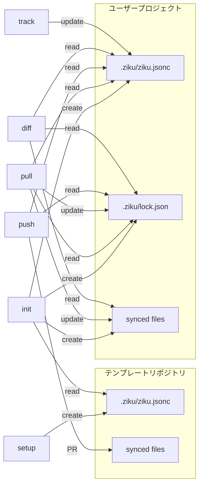

# File Lifecycle

> このドキュメントは `npm run docs` で自動生成されます。直接編集しないでください。

ziku が管理するファイルと、各コマンドでの振る舞いを整理したドキュメント。

<!-- LIFECYCLE:START -->

## コンポーネント関係図

## ファイルごとのライフサイクル

### `.ziku/ziku.jsonc`

**場所:** 両方（テンプレート + ユーザー）  
**役割:** 同期対象パターン定義（include/exclude）。テンプレートとユーザーで同一フォーマット

| フェーズ | 詳細                                                                               |
| -------- | ---------------------------------------------------------------------------------- |
| 生成     | `ziku setup` でデフォルトパターンを含む初期ファイルをテンプレートに作成            |
| 読み取り | `ziku init` でテンプレートのパターンを読み、ディレクトリ選択 UI のデータとして使用 |
| 生成     | `ziku init` で選択結果をユーザープロジェクトに保存                                 |
| 読み取り | `pull` / `push` / `diff` でパターンを取得                                          |
| 更新     | `ziku track` で新しいパターンを追加                                                |

### `.ziku/lock.json`

**場所:** ユーザープロジェクト  
**役割:** 同期状態 + ソース情報（source, baseRef, baseHashes, pendingMerge）

| フェーズ | 詳細                                                                   |
| -------- | ---------------------------------------------------------------------- |
| 生成     | `ziku init` でソース情報 + テンプレートのコミット SHA とハッシュを記録 |
| 読み取り | `pull` / `push` / `diff` でソースと前回同期状態との差分検出に使用      |
| 更新     | `ziku pull` で最新のベースに更新                                       |

### synced files

**場所:** 両方  
**役割:** パターンに一致する実際のファイル群（.claude/rules/\*.md など）

| フェーズ | 詳細                                                     |
| -------- | -------------------------------------------------------- |
| 生成     | `ziku init` でテンプレートからコピー                     |
| 更新     | `ziku pull` で 3-way マージにより同期                    |
| 更新     | `ziku push` でローカル変更を PR としてテンプレートに送信 |

## コマンドごとのファイル操作

### `setup`

テンプレートリポジトリの初期化

| 操作 | ファイル           | 場所     | 詳細                                                  |
| ---- | ------------------ | -------- | ----------------------------------------------------- |
| 作成 | `.ziku/ziku.jsonc` | template | デフォルト include パターンで生成（既存ならスキップ） |

### `init (user project)`

ユーザープロジェクトの初期化

| 操作     | ファイル           | 場所     | 詳細                                               |
| -------- | ------------------ | -------- | -------------------------------------------------- |
| 読み取り | `.ziku/ziku.jsonc` | template | テンプレートの include パターンを取得              |
| 作成     | `.ziku/ziku.jsonc` | local    | 選択パターンを保存                                 |
| 作成     | `.ziku/lock.json`  | local    | ソース情報 + ベースコミット SHA + ハッシュを記録   |
| 作成     | synced files       | local    | テンプレートからパターンに一致するファイルをコピー |

### `pull`

テンプレートの最新更新をローカルに反映

| 操作     | ファイル           | 場所     | 詳細                                   |
| -------- | ------------------ | -------- | -------------------------------------- |
| 読み取り | `.ziku/ziku.jsonc` | local    | patterns を取得                        |
| 読み取り | `.ziku/lock.json`  | local    | source, baseHashes, baseRef を取得     |
| 読み取り | synced files       | template | テンプレートをダウンロードして差分比較 |
| 更新     | synced files       | local    | 自動更新・新規追加・3-way マージ・削除 |
| 更新     | `.ziku/ziku.jsonc` | local    | テンプレートの新パターンをマージ       |
| 更新     | `.ziku/lock.json`  | local    | 新しい baseHashes, baseRef で上書き    |

### `push`

ローカルの変更をテンプレートリポジトリに PR として送信

| 操作     | ファイル           | 場所     | 詳細                                                 |
| -------- | ------------------ | -------- | ---------------------------------------------------- |
| 読み取り | `.ziku/ziku.jsonc` | local    | patterns を取得                                      |
| 読み取り | `.ziku/lock.json`  | local    | source, baseRef, baseHashes を取得                   |
| 読み取り | synced files       | local    | ローカルの変更を検出                                 |
| 読み取り | synced files       | template | テンプレートをダウンロードして差分検出・3-way マージ |
| 更新     | synced files       | template | 変更ファイルを含む PR を作成                         |

### `diff`

ローカルとテンプレートの差分を表示

| 操作     | ファイル           | 場所     | 詳細                               |
| -------- | ------------------ | -------- | ---------------------------------- |
| 読み取り | `.ziku/ziku.jsonc` | local    | patterns を取得                    |
| 読み取り | `.ziku/lock.json`  | local    | source を取得                      |
| 読み取り | synced files       | local    | ローカルファイルを読み取り         |
| 読み取り | synced files       | template | テンプレートをダウンロードして比較 |

### `track`

同期対象のパターンを追加

| 操作     | ファイル           | 場所  | 詳細                            |
| -------- | ------------------ | ----- | ------------------------------- |
| 読み取り | `.ziku/ziku.jsonc` | local | 現在の include パターンを取得   |
| 更新     | `.ziku/ziku.jsonc` | local | 新しいパターンを include に追加 |

## 補足

### ziku.jsonc の役割

`.ziku/ziku.jsonc` はテンプレートとユーザープロジェクトの両方に存在する。
同一フォーマット（include/exclude パターンのみ）で、source 情報は含まない。

`ziku setup` → テンプレートリポに `.ziku/ziku.jsonc` を作成
`ziku init` → テンプレートの `.ziku/ziku.jsonc` を読み、ディレクトリ選択 → 結果をユーザーの `.ziku/ziku.jsonc` に保存

### source 情報の分離

テンプレートの取得元（owner/repo またはローカルパス）は `.ziku/lock.json` に保存される。
これにより `.ziku/ziku.jsonc` はテンプレート・ユーザー間で完全に同一フォーマットになる。

### init 後の独立性

ユーザーが `ziku track` で追加したパターンは `.ziku/ziku.jsonc` にのみ反映される。
テンプレート側で `.ziku/ziku.jsonc` にパターンを追加しても、既存ユーザーの `.ziku/ziku.jsonc` には自動反映されない。
最新のパターンを取り込むには `ziku init` を再実行する。

<!-- LIFECYCLE:END -->
