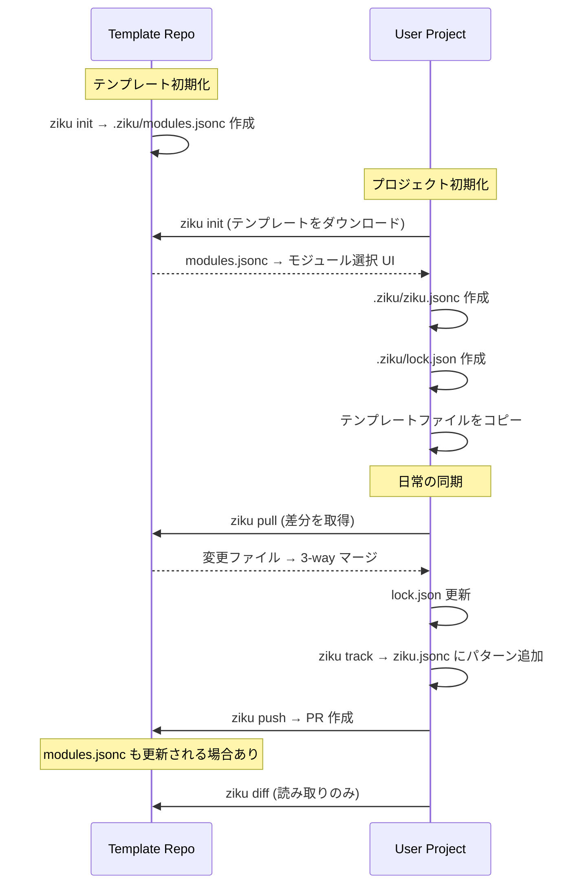

# File Lifecycle

ziku が管理するファイルと、各コマンドでの振る舞いを整理したドキュメント。

## ファイル一覧

| ファイル | 存在する場所 | 役割 |
|---|---|---|
| `.ziku/modules.jsonc` | テンプレートリポジトリのみ | モジュール定義（名前・説明・パターン）。init 時の選択 UI に使われる |
| `.ziku/ziku.jsonc` | ユーザーのプロジェクトのみ | 同期設定。テンプレートの source と、選択済みの include/exclude パターンを保持 |
| `.ziku/lock.json` | ユーザーのプロジェクトのみ | 同期状態。ベースコミット SHA、ファイルハッシュ、未解決マージ情報を保持 |

## コマンドごとのファイル操作

```
┌─────────────────────────────────────────────────────────────────────┐
│ Template Repository (remote)                                        │
│                                                                     │
│  .ziku/modules.jsonc ─── モジュール定義                             │
│  template files      ─── 同期対象のファイル群                       │
└──────────────────────────────────┬──────────────────────────────────┘
                                   │
         ┌─────────────────────────┼─────────────────────────┐
         │                         │                         │
    ziku init                 ziku pull                 ziku push
    (↓ download)              (↓ download)              (↑ PR作成)
         │                         │                         │
         ▼                         ▼                         │
┌─────────────────────────────────────────────────────────────────────┐
│ User Project (local)                                                │
│                                                                     │
│  .ziku/ziku.jsonc ─── 同期設定 (init で生成, track で変更)          │
│  .ziku/lock.json  ─── 同期状態 (init で生成, pull で更新)           │
│  synced files     ─── テンプレートからコピーされたファイル群         │
└─────────────────────────────────────────────────────────────────────┘
```

### `ziku init` (テンプレートリポジトリで実行した場合)

テンプレートリポジトリ自体で `ziku init` を実行すると、scaffold モードになる。

| 操作 | ファイル | 詳細 |
|---|---|---|
| **作成** | `.ziku/modules.jsonc` | デフォルトパターンで生成（既に存在する場合はスキップ） |

### `ziku init` (ユーザーのプロジェクトで実行)

| 操作 | ファイル | 詳細 |
|---|---|---|
| **読み取り** | (remote) `.ziku/modules.jsonc` | テンプレートをダウンロードしてモジュール一覧を取得 |
| **作成** | `.ziku/ziku.jsonc` | 選択されたモジュールのパターンをフラット化して保存 |
| **作成** | `.ziku/lock.json` | ベースコミット SHA とファイルハッシュを記録 |
| **作成** | synced files | テンプレートからパターンに一致するファイルをコピー |

### `ziku pull`

| 操作 | ファイル | 詳細 |
|---|---|---|
| **読み取り** | `.ziku/ziku.jsonc` | source と patterns を取得 |
| **読み取り** | `.ziku/lock.json` | 前回の baseHashes, baseRef を取得 |
| **読み取り** | (remote) template files | テンプレートをダウンロードして差分比較 |
| **更新** | synced files | 自動更新・新規追加・3-way マージ・削除 |
| **更新** | `.ziku/lock.json` | 新しい baseHashes, baseRef で上書き |

### `ziku push`

| 操作 | ファイル | 詳細 |
|---|---|---|
| **読み取り** | `.ziku/ziku.jsonc` | source と patterns を取得 |
| **読み取り** | `.ziku/lock.json` | baseRef, baseHashes を取得 |
| **読み取り** | synced files | ローカルの変更を検出 |
| **リモート変更** | (remote) template files | 変更されたファイルを含む PR を作成 |
| **リモート変更** | (remote) `.ziku/modules.jsonc` | ローカルで追加されたパターンがあれば更新 |

### `ziku diff`

| 操作 | ファイル | 詳細 |
|---|---|---|
| **読み取り** | `.ziku/ziku.jsonc` | patterns を取得 |
| **読み取り** | (remote) template files | テンプレートをダウンロードして比較 |

変更なし（読み取り専用）。

### `ziku track`

| 操作 | ファイル | 詳細 |
|---|---|---|
| **読み取り** | `.ziku/ziku.jsonc` | 現在の include パターンを取得 |
| **更新** | `.ziku/ziku.jsonc` | 新しいパターンを include に追加 |

## ライフサイクル図



## 補足

### modules.jsonc はユーザーのプロジェクトに存在しない

`ziku init` でユーザーのプロジェクトに作られるのは `ziku.jsonc` と `lock.json` だけ。
`modules.jsonc` はテンプレートリポジトリ専用のファイルであり、init 時にモジュール選択 UI を表示するためだけに使われる。
選択結果はフラット化されて `ziku.jsonc` の `include` に保存される。

### ziku.jsonc と modules.jsonc は独立

init 後、`ziku.jsonc` のパターンはテンプレートの `modules.jsonc` から独立している。
ユーザーが `ziku track` で追加したパターンは、テンプレートのどのモジュールにも属さない。
テンプレートが `modules.jsonc` にモジュールを追加しても、既存ユーザーの `ziku.jsonc` には自動反映されない。
