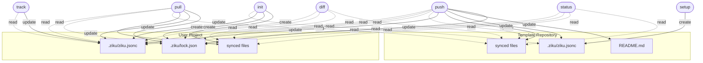

# File Lifecycle

> このドキュメントは `npm run docs` で自動生成されます。直接編集しないでください。

ziku が管理するファイルと、各コマンドでの振る舞いを整理したドキュメント。

<!-- LIFECYCLE:START -->

## コンポーネント関係図

```mermaid
graph TB

  subgraph Template["Template Repository"]
    T_ZIKU_ZIKU_JSONC[".ziku/ziku.jsonc"]
    T_SYNCED_FILES["synced files"]
    T_README_MD["README.md"]
  end

  subgraph User["User Project"]
    U_ZIKU_ZIKU_JSONC[".ziku/ziku.jsonc"]
    U_ZIKU_LOCK_JSON[".ziku/lock.json"]
    U_SYNCED_FILES["synced files"]
  end

  setup([setup]) -->|create| T_ZIKU_ZIKU_JSONC
  init([init]) -.->|read| T_ZIKU_ZIKU_JSONC
  init -->|create| U_ZIKU_ZIKU_JSONC & U_ZIKU_LOCK_JSON & U_SYNCED_FILES
  pull([pull]) -.->|read| U_ZIKU_ZIKU_JSONC & U_ZIKU_LOCK_JSON & T_SYNCED_FILES
  pull -->|update| U_SYNCED_FILES & U_ZIKU_ZIKU_JSONC & U_ZIKU_LOCK_JSON
  push([push]) -.->|read| U_ZIKU_ZIKU_JSONC & U_ZIKU_LOCK_JSON & U_SYNCED_FILES & T_SYNCED_FILES
  push -->|update| U_ZIKU_ZIKU_JSONC & T_SYNCED_FILES & T_ZIKU_ZIKU_JSONC & T_README_MD & U_ZIKU_LOCK_JSON
  diff([diff]) -.->|read| U_ZIKU_ZIKU_JSONC & U_ZIKU_LOCK_JSON & U_SYNCED_FILES & T_SYNCED_FILES
  status([status]) -.->|read| U_ZIKU_ZIKU_JSONC & U_ZIKU_LOCK_JSON & U_SYNCED_FILES & T_SYNCED_FILES
  track([track]) -.->|read| U_ZIKU_ZIKU_JSONC
  track -->|update| U_ZIKU_ZIKU_JSONC

```

## ファイルごとのライフサイクル

### `.ziku/ziku.jsonc`

**役割:** 同期対象パターン定義（include/exclude）。テンプレートとユーザーで同一フォーマット

| 操作     | 場所     | コマンド                                  |
| -------- | -------- | ----------------------------------------- |
| 読み取り | template | `init`                                    |
| 読み取り | local    | `pull`, `push`, `diff`, `status`, `track` |
| 作成     | template | `setup`                                   |
| 作成     | local    | `init`                                    |
| 更新     | template | `push`                                    |
| 更新     | local    | `pull`, `push`, `track`                   |

### `.ziku/lock.json`

**役割:** 同期状態 + ソース情報（source, sync, base, merge）

| 操作     | 場所  | コマンド                         |
| -------- | ----- | -------------------------------- |
| 読み取り | local | `pull`, `push`, `diff`, `status` |
| 作成     | local | `init`                           |
| 更新     | local | `pull`, `push`                   |

### synced files

**役割:** パターンに一致する実際のファイル群（.claude/rules/\*.md など）

| 操作     | 場所     | コマンド                         |
| -------- | -------- | -------------------------------- |
| 読み取り | template | `pull`, `push`, `diff`, `status` |
| 読み取り | local    | `push`, `diff`, `status`         |
| 作成     | local    | `init`                           |
| 更新     | template | `push`                           |
| 更新     | local    | `pull`                           |

### `README.md`

| 操作 | 場所     | コマンド |
| ---- | -------- | -------- |
| 更新 | template | `push`   |

## コマンドごとのファイル操作

### `setup`

Initialize a template repository

| 操作 | ファイル           | 場所     | 詳細                                                  |
| ---- | ------------------ | -------- | ----------------------------------------------------- |
| 作成 | `.ziku/ziku.jsonc` | template | デフォルト include パターンで生成（既存ならスキップ） |

### `init (user project)`

Initialize user project from template

| 操作     | ファイル           | 場所     | 詳細                                                                      |
| -------- | ------------------ | -------- | ------------------------------------------------------------------------- |
| 読み取り | `.ziku/ziku.jsonc` | template | テンプレートの include パターンを取得し、ディレクトリ選択 UI の候補にする |
| 作成     | `.ziku/ziku.jsonc` | local    | 選択パターンを保存                                                        |
| 作成     | `.ziku/lock.json`  | local    | ソース情報 + ベースコミット SHA + ハッシュを記録                          |
| 作成     | synced files       | local    | テンプレートからパターンに一致するファイルをコピー                        |

### `pull`

Pull latest template updates to local project

| 操作     | ファイル           | 場所     | 詳細                                                                  |
| -------- | ------------------ | -------- | --------------------------------------------------------------------- |
| 読み取り | `.ziku/ziku.jsonc` | local    | patterns を取得                                                       |
| 読み取り | `.ziku/lock.json`  | local    | source と同期ベースを取得                                             |
| 読み取り | synced files       | template | テンプレートをダウンロードして差分比較                                |
| 更新     | synced files       | local    | 自動更新・新規追加・3-way マージ・削除                                |
| 更新     | `.ziku/ziku.jsonc` | local    | 加法 union マージで同期（テンプレの追加を取り込む。削除は伝播しない） |
| 更新     | `.ziku/lock.json`  | local    | 新しい同期ベースで上書き                                              |

### `push`

Push local changes to template (GitHub: PR / local: direct copy)

| 操作     | ファイル           | 場所     | 詳細                                                                            |
| -------- | ------------------ | -------- | ------------------------------------------------------------------------------- |
| 読み取り | `.ziku/ziku.jsonc` | local    | patterns を取得                                                                 |
| 更新     | `.ziku/ziku.jsonc` | local    | 選択した未追跡ファイルを include に追記（push 成功後）                          |
| 読み取り | `.ziku/lock.json`  | local    | source と同期ベースを取得                                                       |
| 読み取り | synced files       | local    | ローカルの変更を検出                                                            |
| 読み取り | synced files       | template | テンプレートと差分検出・3-way マージ                                            |
| 更新     | synced files       | template | GitHub: PR を作成 / ローカル: ファイルを直接コピー                              |
| 更新     | `.ziku/ziku.jsonc` | template | ローカルで追加したパターンをテンプレの ziku.jsonc へ加法 union マージで伝播     |
| 更新     | `README.md`        | template | マーカーがあれば同期対象一覧を反映した内容を PR に同梱（GitHub への push のみ） |
| 更新     | `.ziku/lock.json`  | local    | 同期ベースを更新                                                                |

### `diff`

Show differences between local and template

| 操作     | ファイル           | 場所     | 詳細                               |
| -------- | ------------------ | -------- | ---------------------------------- |
| 読み取り | `.ziku/ziku.jsonc` | local    | patterns を取得                    |
| 読み取り | `.ziku/lock.json`  | local    | source を取得                      |
| 読み取り | synced files       | local    | ローカルファイルを読み取り         |
| 読み取り | synced files       | template | テンプレートをダウンロードして比較 |

### `status`

Show pending pull/push counts and recommend next action

| 操作     | ファイル           | 場所     | 詳細                                         |
| -------- | ------------------ | -------- | -------------------------------------------- |
| 読み取り | `.ziku/ziku.jsonc` | local    | patterns を取得                              |
| 読み取り | `.ziku/lock.json`  | local    | 同期ベースとコンフリクト解決待ちの状態を取得 |
| 読み取り | synced files       | local    | ローカルファイルのハッシュを計算             |
| 読み取り | synced files       | template | テンプレートをダウンロードしてハッシュを計算 |

### `track`

Add file patterns to the sync whitelist

| 操作     | ファイル           | 場所  | 詳細                            |
| -------- | ------------------ | ----- | ------------------------------- |
| 読み取り | `.ziku/ziku.jsonc` | local | 現在の include パターンを取得   |
| 更新     | `.ziku/ziku.jsonc` | local | 新しいパターンを include に追加 |

### `aggregate`

Inventory unsynced diffs across repositories using this template (read-only)

| 操作     | ファイル           | 場所     | 詳細                                                                                    |
| -------- | ------------------ | -------- | --------------------------------------------------------------------------------------- |
| 読み取り | `.ziku/ziku.jsonc` | template | 比較基準となる include/exclude パターンを取得                                           |
| 読み取り | `.ziku/lock.json`  | remote   | owner 配下の候補リポジトリの lock.json を取得し、対象テンプレートの利用リポジトリか判定 |
| 読み取り | synced files       | template | 比較基準としてテンプレートを指定 commit でダウンロードしハッシュ計算                    |
| 読み取り | synced files       | remote   | 利用リポジトリをダウンロードし、テンプレートとハッシュ比較して未同期差分を分類          |

## 補足

### init (user project)

`ziku.jsonc` はテンプレートとユーザープロジェクトの両方に存在する。同一フォーマット（include/exclude パターンのみ）で、source 情報は含まない。

テンプレートの取得元（owner/repo またはローカルパス）は `lock.json` に保存される。これにより `ziku.jsonc` はテンプレート・ユーザー間で完全に同一フォーマットになる。

### pull

`ziku.jsonc` 自体が追跡ファイルとして加法 union マージされる。テンプレ側で追加されたパターンはユーザーの `ziku.jsonc` へ取り込まれる（push と双方向に同期）。パターンの削除は自動伝播しない（安全側）。

テンプレートで削除されたファイルは、対話実行ではユーザーが選択的に削除できる。`--force` は削除の承認なので全て削除し、`--yes` はプロンプトを省くだけなので全て残す。ローカルに編集があるものはどちらのフラグでも削除せず、対話実行で明示的に選んだものだけを削除する。

ローカルに残したファイルは同期ベースを据え置くため、次回の `pull` でも同じ削除候補として提示される。ベースを進めるとローカルにしかないファイルと区別できなくなり、続く `push` がテンプレート側の削除を巻き戻してしまう。テンプレートとローカルの双方から既に消えているファイルは、消すものが無いので削除候補として提示せず、ベースからエントリを落とす。

自動マージを試みなかったファイル（共通祖先を取得できない / バイナリ）は、`--continue` がローカルとテンプレートのどちらを残すか尋ねる。ziku がそれらのファイルへ何も書いていないため、コンフリクトマーカーの有無では解決を判定できない。`--yes` / `--force` を付けた実行では代わりに決めず中断する。

### push

`ziku.jsonc` 自体が追跡ファイルとして同期対象に含まれる。`ziku track` で追加したローカルパターンは、push 時にテンプレートの `ziku.jsonc` へ加法 union マージで伝播する（pull と双方向）。パターンの削除は自動伝播しない。

### status

`status` は読み取り専用。ファイルや lock.json を一切変更しない。

`status` は git status と同じく常に exit 0 で終了する（観察コマンドの責務）。CI でゲートしたい場合は将来 `pull --dry-run` や `diff --exit-code` 等の専用コマンドに任せる予定。

### track

`ziku track` で追加したパターンはローカルの `ziku.jsonc` にのみ反映される。テンプレートに反映するには `ziku push` でテンプレートの `ziku.jsonc` を更新する。

### aggregate

`aggregate` は読み取り専用。GitHub 上のどのリポジトリの状態も変更しない。

出力する JSON レポートは棚卸し結果であり、テンプレートへの統合（変更の反映）はこのコマンド自身では行わない。統合は後段のエージェントやオペレーターが別途 `push` 等で行う。

<!-- LIFECYCLE:END -->
