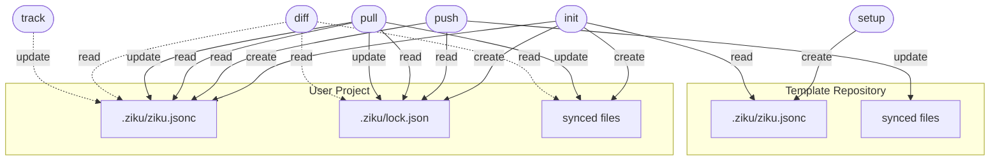

---
# This file is auto-generated by scripts/generate-site.ts — do not edit directly.
---

# How it Works



> For detailed file operations per command, see [File Lifecycle](/architecture/file-lifecycle).

## The config file

Both the template and user project share the same `.ziku/ziku.jsonc` format — just `include` and `exclude` patterns:

```jsonc
{
  "include": [".claude/rules/*.md", ".mcp.json", ".github/workflows/**"],
}
```

## Command overview

| Command                   | Who runs it     | What it does                                                     |
| ------------------------- | --------------- | ---------------------------------------------------------------- |
| **`setup`**               | Template author | Initialize a template repository                                 |
| **`init (user project)`** | Template user   | Initialize user project from template                            |
| **`pull`**                | Template user   | Pull latest template updates to local project                    |
| **`push`**                | Template user   | Push local changes to template (GitHub: PR / local: direct copy) |
| **`diff`**                | Template user   | Show differences between local and template                      |
| **`track`**               | Template user   | Add file patterns to the sync whitelist                          |

Template source info (owner/repo or local path) is stored in `.ziku/lock.json`, separate from patterns. When you `pull`, new patterns added to the template's `.ziku/ziku.jsonc` are automatically merged into yours.

> For detailed file operations per command, see [File Lifecycle](/architecture/file-lifecycle).
